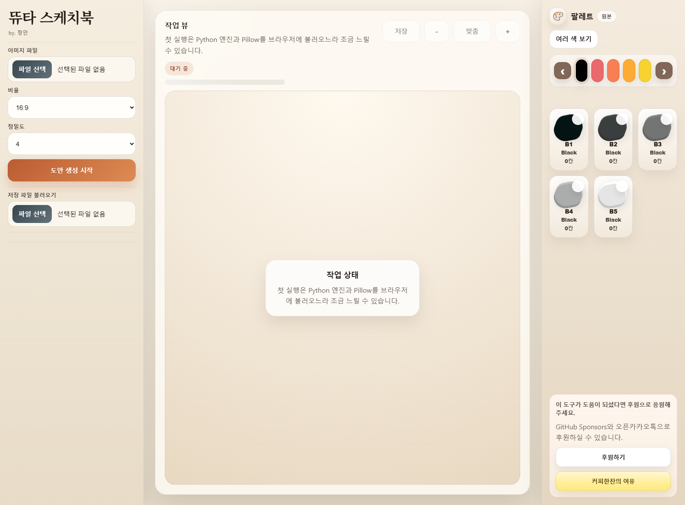
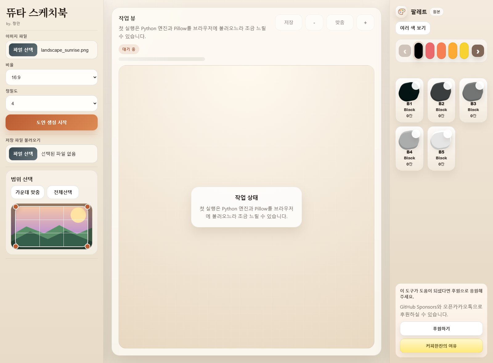
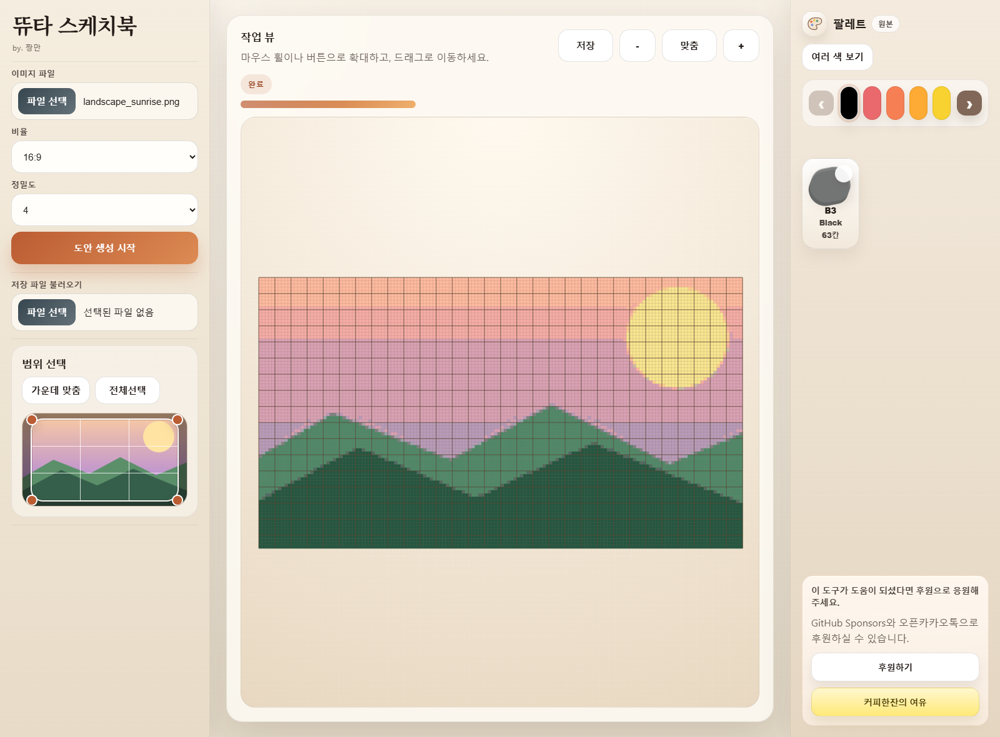
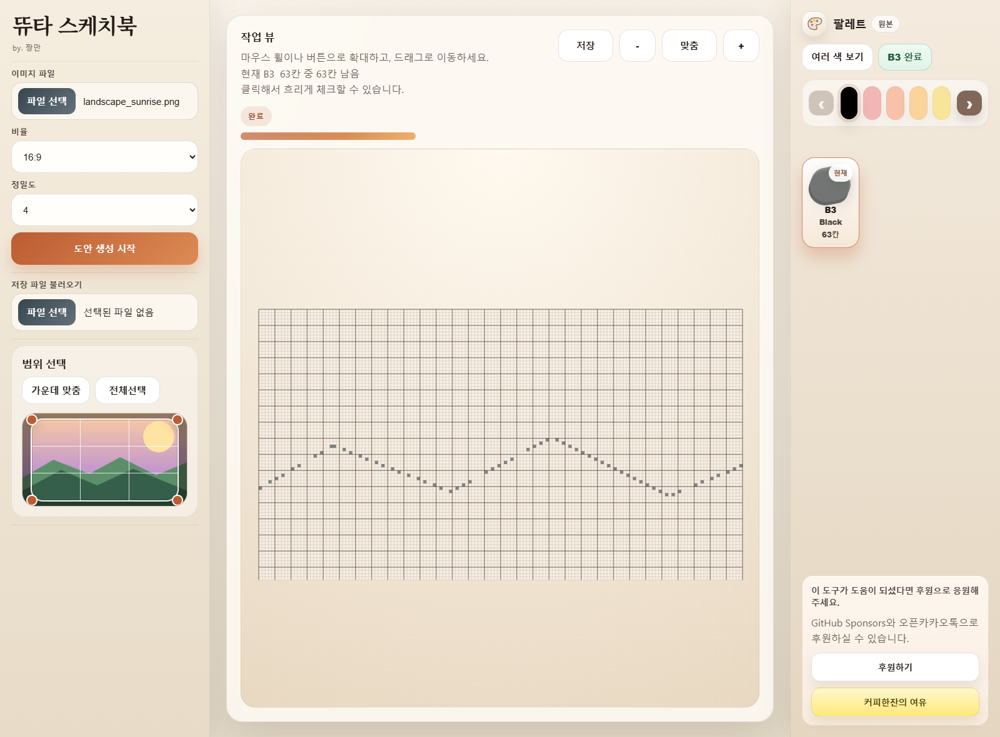
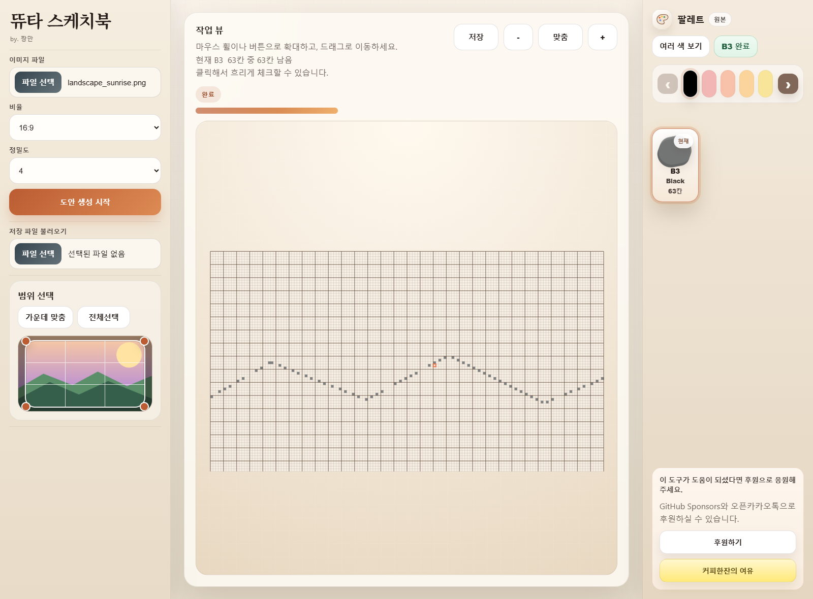
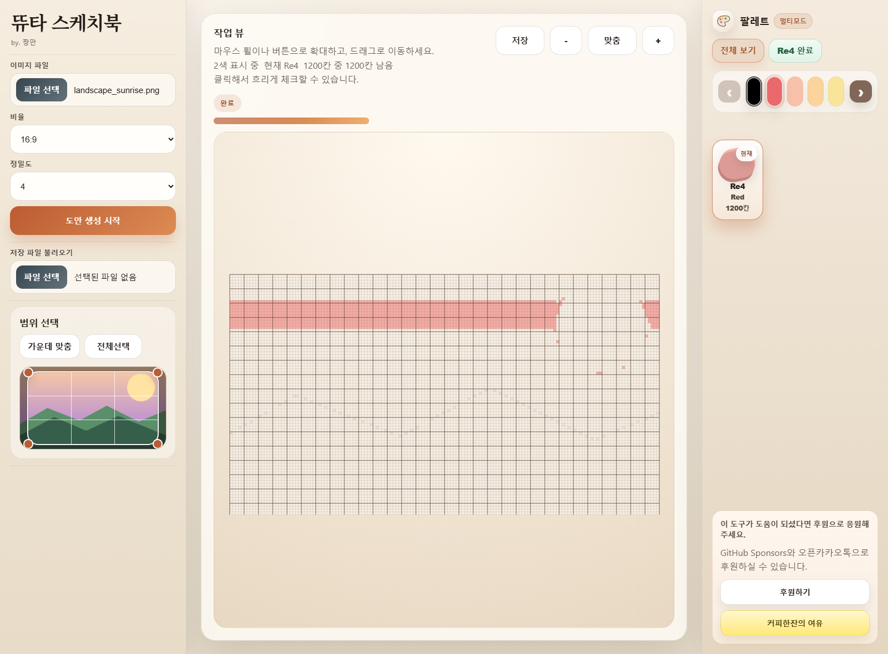
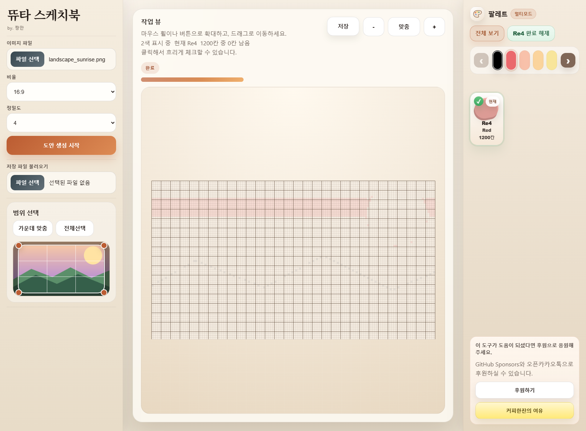
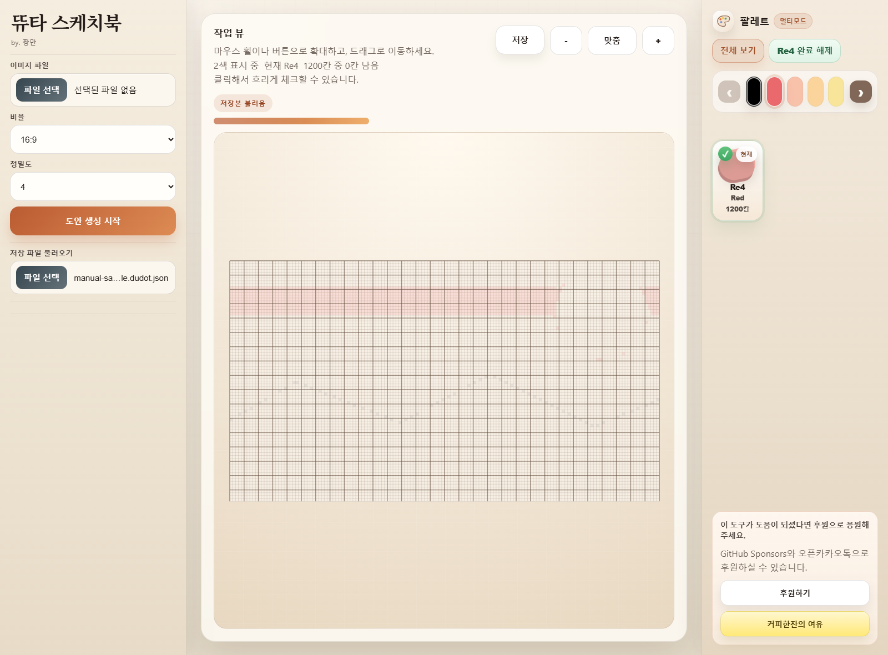

# 두근두근타운 스케치북 도트변환

두근두근타운 스케치북 이미지를 업로드해서 도트 도안으로 바꿔주는 웹 도구입니다.

## 소개

- 이미지를 업로드하고 원하는 비율로 변환할 부분을 선택할 수 있습니다.
- 정밀도에 따라 캔버스 크기를 바꿔 도트 도안을 만들 수 있습니다.
- 125색 팔레트 기준으로 가장 가까운 색상 코드로 변환합니다.
- 완성된 도안을 확대, 이동, 색상별 필터링으로 확인할 수 있습니다.
- 저장 파일(`.dudot.json`)로 내보내고 다시 불러올 수 있습니다.

## 도트변환 사이트

- [사이트 바로가기](https://chang-mini.github.io/heartopia-sketchbook-dot/)

## 후원

- [GitHub Sponsors로 후원하기](https://github.com/sponsors/chang-mini)
- [커피한잔의 여유(오픈카톡)](https://open.kakao.com/o/svvxQWki)
- 이 도구가 계속 업데이트될 수 있도록 후원으로 응원할 수 있습니다.

## 사용설명서

배포 주소: https://chang-mini.github.io/heartopia-sketchbook-dot/

이 문서는 `뜌타 스케치북` 도트변환 웹의 실제 화면을 기준으로, 첫 화면부터 업로드, 도안 생성, 팔레트 활용, 세부색 작업, 저장/불러오기까지 전 기능을 빠짐없이 정리한 사용설명서입니다.

스크린샷은 로컬에서 실제 페이지를 열어 직접 캡처한 예시입니다.

### 1. 구성

이 도구는 이미지를 업로드한 뒤 원하는 비율과 범위를 선택해서, 스케치북 작업용 도트 도안으로 변환해주는 웹입니다.

핵심 특징은 아래와 같습니다.

- 이미지 업로드 후 잘라낼 범위를 직접 조절할 수 있습니다.
- `16:9`, `4:3`, `1:1`, `3:4`, `9:16` 비율을 지원합니다.
- 정밀도 `1`부터 `4`까지 선택할 수 있습니다.
- 브라우저 안에서 바로 도안 생성이 진행됩니다.
- 생성된 도안을 작업 뷰에서 확대, 이동, 세부색 필터, 완료 체크로 관리할 수 있습니다.
- 현재 도안 상태를 저장 파일로 내보내고, 다시 불러와 이어서 작업할 수 있습니다.

### 2. 첫 화면 구성

첫 화면은 크게 세 영역으로 나뉩니다.

- 왼쪽 사이드바: 이미지 파일, 비율, 정밀도, 도안 생성 시작, 저장 파일 불러오기, 범위 선택 영역
- 가운데 작업 뷰: 생성된 도안을 확대/축소/이동하며 확인하는 영역
- 오른쪽 팔레트: 현재 도안에서 실제로 사용된 색상 그룹과 세부색 코드를 확인하고 선택하는 영역

첫 실행은 브라우저에서 Python 엔진과 Pillow를 불러오기 때문에 조금 느릴 수 있습니다.

### 3. 기본 사용 순서

1. `이미지 파일`에서 원본 이미지를 업로드합니다.
2. `비율`과 `정밀도`를 선택합니다.
3. 범위 선택 화면에서 사용할 구역을 맞춥니다.
4. `도안 생성 시작`을 누릅니다.
5. 작업 뷰와 팔레트에서 세부색을 선택하며 작업합니다.
6. 필요하면 `저장`으로 현재 상태를 저장합니다.
7. 나중에 `저장 파일 불러오기`로 이어서 작업합니다.

### 4. 이미지 업로드와 도안 생성 설정

#### 4.1 이미지 업로드

- `이미지 파일` 입력에서 이미지를 선택합니다.
- 지원 형식은 `PNG`, `JPG/JPEG`, `WEBP` 입니다.
- 잘못된 파일 형식을 올리면 경고창이 뜹니다.

#### 4.2 비율 설정

`비율` 드롭다운에서 아래 값을 선택할 수 있습니다.

- `16:9`
- `4:3`
- `1:1`
- `3:4`
- `9:16`

비율을 바꾸면 범위 선택 박스가 해당 비율에 맞춰 다시 계산됩니다.

#### 4.3 정밀도 설정

`정밀도`는 `1`, `2`, `3`, `4` 중 하나를 고를 수 있습니다.

- 숫자가 커질수록 더 촘촘한 도안이 생성됩니다.
- 기본값은 `4`입니다.

### 5. 범위 선택 사용법

이미지를 업로드하면 `범위 선택` 패널이 열립니다.

여기서 가능한 동작은 아래와 같습니다.

- 선택 박스 안을 드래그해서 위치를 이동
- 모서리 핸들을 드래그해서 크기 조절
- `가운데 맞춤` 버튼으로 현재 비율 기준 중앙 영역으로 다시 맞춤
- `전체선택` 버튼으로 이미지 전체를 선택
- 범위 선택 프레임을 더블클릭해서 중앙 기준으로 다시 맞춤

하단 안내 문구에는 현재 선택 영역의 픽셀 크기, 비율, 조작 방법이 표시됩니다.

### 6. 도안 생성 후 작업 뷰 보는 법

도안 생성이 끝나면 가운데 `작업 뷰`에 결과가 표시됩니다.

여기서 확인할 수 있는 항목은 아래와 같습니다.

- `상태 배지`: 현재 상태 표시
- `진행 바`: 도안 생성 또는 불러오기 진행 상태
- `저장` 버튼: 현재 결과를 저장 파일로 내려받기
- `-`, `맞춤`, `+` 버튼: 축소, 화면 맞춤, 확대
- 캔버스: 실제 도트 도안 작업 영역

작업 뷰 조작 방법은 아래와 같습니다.

- 마우스 휠: 확대/축소
- `-`, `+`, `맞춤`: 버튼으로 확대/축소/화면 맞춤
- 드래그: 확대된 도안을 이동

### 7. 팔레트 보는 법

오른쪽 `팔레트` 영역은 현재 도안에서 실제로 사용된 색만 보여줍니다.

구성은 아래와 같습니다.

- 상단 제목: `팔레트`
- 모드 표시: `원본` 또는 `멀티모드`
- `여러 색 보기` / `전체 보기` 버튼: 멀티 선택 모드 전환
- `완료` 버튼: 현재 세부색 전체를 한 번에 완료 처리 또는 완료 해제
- 그룹 이동 화살표: 사용 색상 그룹을 좌우로 넘기기
- 그룹 버튼 트랙: 계열별 색상 그룹 보기
- 세부색 칩 목록: 실제 코드, 그룹명, 사용 칸 수 표시

세부색 칩에는 아래 정보가 들어 있습니다.

- 색상 코드-뜌타 팔레트 그룹색상의 몇번째 색상인지 -예) B1이면 블랙에 첫번째 색상
- 그룹 이름
- 해당 코드가 쓰인 칸 수
- 완료 여부 체크 표시
- 멀티 모드에서 현재/이전 선택 순서 배지

### 8. 세부색 선택 작업

세부색 칩을 누르면 작업 뷰에서 해당 색을 기준으로 작업할 수 있습니다.

단일 선택 모드의 동작은 아래와 같습니다.

- 세부색 하나를 클릭하면 그 색이 현재 작업 색이 됩니다.
- 현재 색의 칸만 선명하게 보기 쉽도록 강조됩니다.
- 작업 뷰 상단 안내 문구에 현재 코드와 남은 칸 수가 표시됩니다.
- 같은 세부색을 다시 누르면 선택이 해제되고 전체 보기로 돌아갑니다.

### 9. 셀 선택과 완료 체크

세부색을 선택한 상태에서는 작업 뷰에서 해당 색 칸을 직접 클릭해 완료 표시를 남길 수 있습니다.

셀 선택 규칙은 아래와 같습니다.

- 세부색이 하나도 선택되지 않았으면 셀 체크가 동작하지 않습니다.
- 현재 선택된 세부색에 해당하는 칸만 클릭해서 체크할 수 있습니다.
- 같은 칸을 다시 클릭하면 체크가 해제됩니다.
- 체크된 칸은 흐리게 표시되어 작업한 부분을 구분할 수 있습니다.
- 현재 세부색의 남은 칸 수가 상단 안내 문구에 반영됩니다.

현재 버전 기준으로, 체크 흐리기는 `세부색이 선택된 상태에서 현재 활성 세부색`에만 표시됩니다. 전체 보기로 돌아가면 흐리기 표시가 사라집니다.

### 10. 여러 색 보기(멀티 모드)

`여러 색 보기` 버튼을 누르면 멀티 모드가 켜집니다. 이 상태에서는 세부색을 여러 개 함께 선택할 수 있습니다.

멀티 모드 동작은 아래와 같습니다.

- 버튼 문구가 `전체 보기`로 바뀝니다.
- 모드 표시가 `멀티모드`로 바뀝니다.
- 여러 세부색 칩을 차례로 선택할 수 있습니다.
- 마지막에 누른 세부색이 `현재` 색이 됩니다.
- 이전에 선택된 세부색은 순서 배지로 표시됩니다.
- 작업 뷰에는 선택한 여러 색이 함께 표시됩니다.
- 현재 세부색은 가장 강조되고, 이전 선택 색은 보조 강조로 표시됩니다.
- 멀티 모드에서 현재 세부색 칩을 다시 누르면 선택 목록에서 빠집니다.
- `전체 보기` 버튼을 누르면 멀티 모드가 꺼지고 전체 보기 상태로 돌아갑니다.

멀티 모드에서 셀 체크는 선택된 색들에 대해 가능하지만, 완료 흐리기 표시는 현재 활성 세부색 기준으로 확인하는 것이 가장 명확합니다.

### 11. 완료 버튼 사용법

세부색을 선택하면 상단에 `완료` 버튼이 나타납니다.

이 버튼의 동작은 아래와 같습니다.

- 현재 세부색이 선택되어 있을 때만 표시됩니다.
- 버튼 문구는 `코드명 완료` 또는 `코드명 완료 해제` 형태로 바뀝니다.
- 누르면 현재 세부색에 해당하는 모든 칸을 한 번에 완료 처리합니다.
- 다시 누르면 같은 세부색의 완료 상태를 한 번에 해제합니다.
- 세부색 칩에도 완료 체크 표시가 반영됩니다.

개별 클릭과 전체 완료 버튼은 함께 사용할 수 있습니다.

### 12. 저장 기능

도안이 생성되거나 저장본이 불러와진 뒤에는 `저장` 버튼을 사용할 수 있습니다.

저장 기능의 특징은 아래와 같습니다.

- 파일명은 `원본파일명-비율-p정밀도.dudot.json` 형식으로 내려받습니다.
- 저장 파일에는 아래 정보가 함께 들어갑니다.
- 도안 크기와 코드 데이터
- 사용 색상 목록
- 완료 체크한 셀 목록
- 현재 세부색 선택 상태
- 멀티 모드 상태
- 이전에 기억한 멀티 선택 상태

즉 단순 이미지 결과만 저장하는 것이 아니라, 작업 진행 상태까지 함께 저장합니다.

### 13. 저장 파일 불러오기

왼쪽 `저장 파일 불러오기` 입력을 사용하면 저장한 작업을 다시 열 수 있습니다.

지원 형식은 아래와 같습니다.

- `.dudot`
- `.dudot.json`
- `.json`

불러오기 동작은 아래와 같습니다.

- 저장 파일을 선택하면 바로 내용을 읽습니다.
- 형식이 올바르면 작업 뷰와 팔레트가 즉시 복원됩니다.
- 완료 체크 상태가 복원됩니다.
- 현재 세부색 선택과 멀티 선택 상태가 복원됩니다.
- 상태 배지가 `저장본 불러옴`으로 바뀝니다.
- 잘못된 형식이면 경고창이 뜹니다.

### 14. 그룹 이동과 세부색 탐색

팔레트 그룹 탐색 기능은 아래와 같습니다.

- 상단 색상 그룹 버튼으로 해당 계열을 선택할 수 있습니다.
- 한 번에 5개 그룹씩 보여줍니다.
- 좌우 화살표로 이전/다음 그룹 페이지로 이동할 수 있습니다.
- 특정 세부색을 고르면 그 색이 속한 그룹이 현재 그룹으로 자동 이동합니다.
- 세부색 선택이 있을 때 관련 없는 그룹과 칩은 더 흐리게 표시되어 집중하기 쉽습니다.

### 15. 상태 표시와 안내 문구

작업 중 확인할 수 있는 안내는 아래와 같습니다.

- 대기 중: 아직 작업 전
- 준비 중: 업로드한 영역 정리 중
- 파이썬 처리 중: 브라우저 내부 변환 중
- 정리 중: 결과를 화면에 반영하는 중
- 완료: 도안 생성 완료
- 저장본 불러옴: 저장 파일을 정상적으로 읽은 상태

작업 뷰 안내 문구는 상황에 따라 아래 정보를 보여줍니다.

- 확대/축소, 드래그 이동 방법
- 현재 선택한 세부색 코드
- 멀티 모드에서는 현재 색과 선택 색 수
- 현재 색의 총 칸 수와 남은 칸 수

### 16. 자주 쓰는 실전 작업 흐름

#### 16.1 새 이미지를 도안으로 만들기

1. 이미지 업로드
2. 비율 선택
3. 정밀도 선택
4. 범위 조절
5. 도안 생성 시작
6. 팔레트에서 세부색 선택
7. 작업 뷰에서 셀 체크
8. 필요하면 저장

#### 16.2 여러 색을 같이 보면서 작업하기

1. 세부색 하나 선택
2. `여러 색 보기` 클릭
3. 다른 세부색을 추가 선택
4. 마지막에 누른 색을 기준으로 작업
5. 필요하면 `전체 보기`로 복귀

#### 16.3 저장한 도안 이어서 작업하기

1. `저장 파일 불러오기`에서 저장 파일 선택
2. 상태가 `저장본 불러옴`으로 바뀌는지 확인
3. 복원된 완료 체크와 세부색 상태로 이어서 작업

### 17. 기능 체크리스트

| 기능 | 사용 방법 | 비고 |
| --- | --- | --- |
| 이미지 업로드 | `이미지 파일`에서 선택 | PNG/JPG/JPEG/WEBP 지원 |
| 비율 변경 | `비율` 드롭다운 | 16:9, 4:3, 1:1, 3:4, 9:16 |
| 정밀도 변경 | `정밀도` 드롭다운 | 1~4 |
| 도안 생성 | `도안 생성 시작` 클릭 | 첫 실행은 느릴 수 있음 |
| 범위 이동 | 선택 박스 드래그 | 업로드 후 사용 |
| 범위 크기 조절 | 모서리 핸들 드래그 | 업로드 후 사용 |
| 가운데 맞춤 | `가운데 맞춤` 클릭 | 현재 비율 기준 |
| 전체 선택 | `전체선택` 클릭 | 업로드한 사진 전체 사용 |
| 범위 리셋 | 범위 프레임 더블클릭 | 가운데 맞춤과 유사 |
| 확대/축소 | 휠, `-`, `+` 버튼 | 작업 뷰에서 사용 |
| 맞춤 보기 | `맞춤` 버튼 | 전체 도안을 다시 맞춤 |
| 화면 이동 | 작업 뷰 드래그 | 확대 상태에서 유용 |
| 세부색 선택 | 팔레트 칩 클릭 | 단일 작업 모드 |
| 세부색 해제 | 같은 칩 다시 클릭 | 전체 보기로 복귀 |
| 셀 체크 | 작업 뷰에서 해당 칸 클릭 | 세부색 선택 중에만 가능 |
| 전체 완료 | `완료` 클릭 | 현재 세부색 전체 처리 |
| 완료 해제 | `완료 해제` 클릭 | 현재 세부색 전체 해제 |
| 멀티 모드 | `여러 색 보기` 클릭 | 여러 세부색 동시 선택 |
| 멀티 종료 | `전체 보기` 클릭 | 전체 보기로 복귀 |
| 그룹 이동 | 좌우 화살표 클릭 | 메인 색상 5개씩 페이지 이동 |
| 그룹 선택 | 상단 그룹 버튼 클릭 | 해당 계열 세부색 보기 |
| 저장 | `저장` 클릭 | `.dudot.json` 다운로드 |
| 저장본 불러오기 | `저장 파일 불러오기` 사용 | 완료 상태까지 복원 |

### 18. 사용 팁

- 처음 생성이 느릴 때는 오류가 아니라 브라우저 내부 런타임 준비일 가능성이 큽니다.
- 한 색씩 차례대로 작업하고 싶으면 단일 선택 모드가 가장 편합니다.
- 완료한 색을 보면서 작업하고 싶으면 멀티 모드를 쓰는 것이 좋습니다.
- 저장 파일은 작업 백업용으로 자주 저장해 두는 것이 안전합니다.
- 전체 보기에서는 흐리기 표시가 사라지므로, 작업 진행률 확인은 세부색을 선택한 상태에서 보는 것이 가장 정확합니다.
