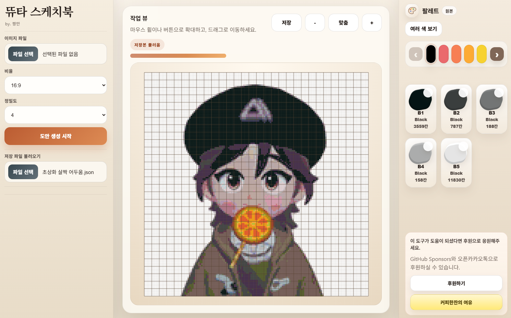

# 두근두근타운 스케치북 도트변환

두근두근타운 스케치북 이미지를 업로드해서 도트 도안으로 바꿔주는 웹 도구입니다.

## 소개

- 이미지를 업로드하고 원하는 비율로 변환할 부분을 선택할 수 있습니다.
- 정밀도에 따라 캔버스 크기를 바꿔 도트 도안을 만들 수 있습니다.
- 125색 팔레트 기준으로 가장 가까운 색상 코드로 변환합니다.
- 완성된 도안을 확대, 이동, 색상별 필터링으로 확인할 수 있습니다.
- 저장 파일(`.dudot.json`)로 내보내고 다시 불러올 수 있습니다.

## 도트변환 사이트

- [사이트 바로가기](https://chang-mini.github.io/heartopia-sketchbook-dot/)

## 후원

- [GitHub Sponsors로 후원하기](https://github.com/sponsors/chang-mini)
- [커피한잔의 여유(오픈카톡)](https://open.kakao.com/o/svvxQWki)
- 이 도구가 계속 업데이트될 수 있도록 후원으로 응원할 수 있습니다.

## 사용설명서

- [프로젝트 사용설명서](./프로젝트%20사용설명서.md)
