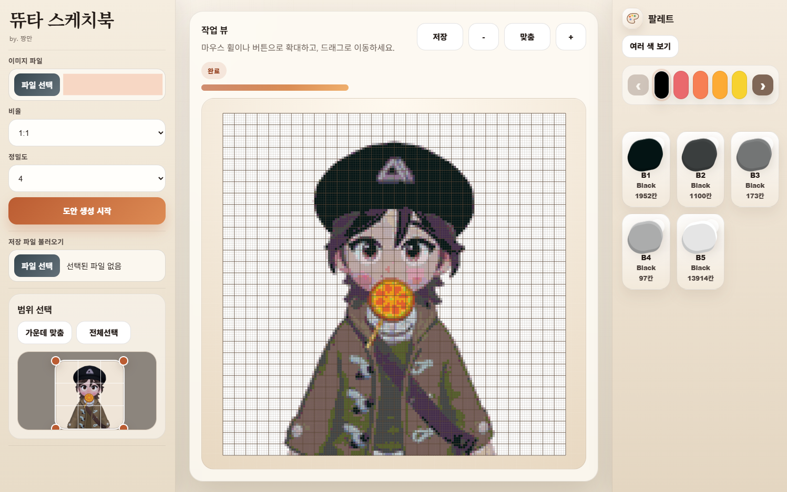

# 두근두근타운 스케치북 도트변환

두근두근타운 스케치북 이미지를 업로드해서 도트 도안으로 바꿔주는 웹 도구입니다.



## 소개

- 이미지를 업로드하고 원하는 비율로 크롭할 수 있습니다.
- 정밀도에 따라 캔버스 크기를 바꿔 도트 도안을 만들 수 있습니다.
- 125색 팔레트 기준으로 가장 가까운 색상 코드로 변환합니다.
- 완성된 도안을 확대, 이동, 색상별 필터링으로 확인할 수 있습니다.
- 저장 파일(`.dudot.json`)로 내보내고 다시 불러올 수 있습니다.

## 사용 방법

1. 이미지 파일을 업로드합니다.
2. 비율과 정밀도를 선택합니다.
3. 크롭 범위를 맞춘 뒤 `도안 생성 시작`을 누릅니다.
4. 오른쪽 팔레트에서 사용된 색상 코드를 확인합니다.
5. 필요하면 저장 버튼으로 현재 결과를 파일로 저장합니다.

## 배포 주소

- GitHub Pages: `https://chang-mini.github.io/heartopia-sketchbook-dot/`

## 기술 메모

- 정적 웹앱입니다.
- 서버 없이 브라우저 안에서 이미지 처리와 팔레트 매핑이 실행됩니다.
- GitHub Pages에 바로 배포할 수 있게 구성했습니다.

## 이미지 추가 방법

이미지를 더 넣고 싶으면 저장소 안 `assets/` 폴더에 파일을 올린 뒤 아래처럼 적으면 됩니다.

```md

```
